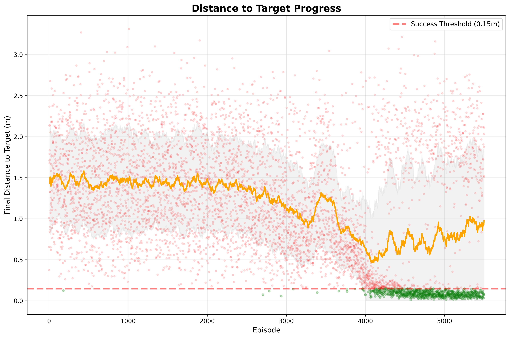
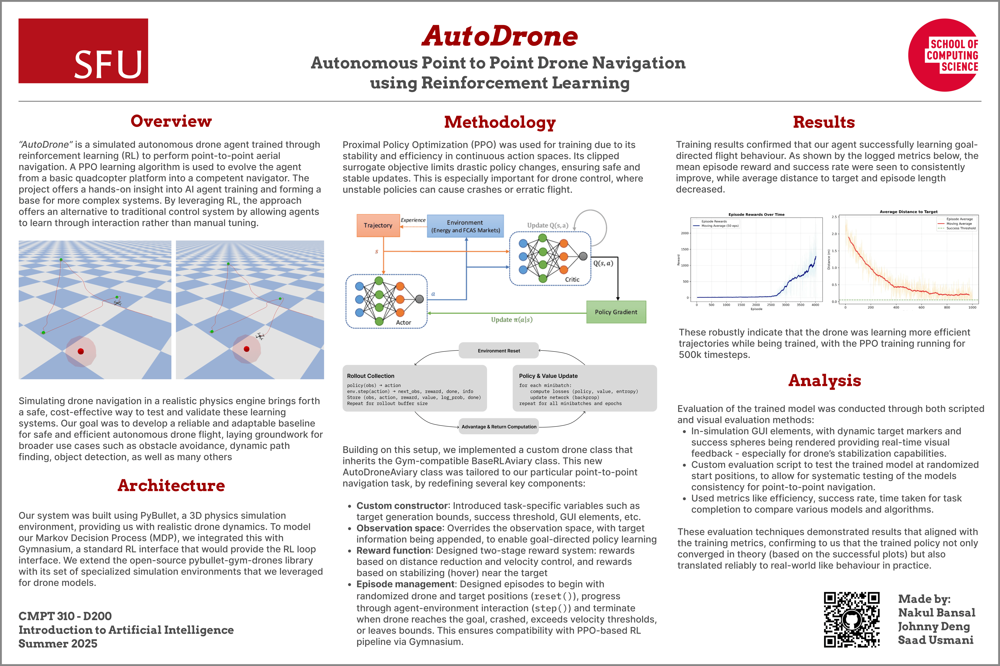

# AutoDrone

“AutoDrone” is a simulated autonomous drone agent trained through reinforcement learning (RL) to perform point-to-point aerial navigation. A PPO learning algorithm is used to evolve the agent from a basic quadcopter platform into a competent navigator. The project offers hands-on insight into AI agent training and forms a base for more complex systems. By leveraging RL, this approach offers an alternative to traditional control systems by allowing agents to learn through interaction rather than manual tuning.

https://github.com/user-attachments/assets/8908715b-f8a1-42b0-93a0-7b08307ad68c

# Project Installation

```zsh
git clone git@github.com:Nakul727/autodrone.git
cd autodrone
git submodule update --init --recursive
```

<br>

Things to note:

- We need Python<=3.11 to install pybullet. To use this specific version of Python and install other fixed versions of modules, we will use `conda` to manage our environment ([Miniconda Installation link](https://www.anaconda.com/docs/getting-started/miniconda/main)).
- This project is built on gym-pybullet-drones, a framework that provides basic tools like physics simulation and drone models, and makes it easier to implement RL for drones in pybullet and gymnasium. This will be installed as a submodule.

<br>

Please run the following commands to install dependencies:

```zsh
conda env create -f environment.yml
conda activate autodrone
pip install --no-deps -e gym-pybullet-drones/
```

# Running the project

## File structure

```
autodrone/
├── assets                  # Images, poster, and other resources
├── environment.yml         # Conda environment specification
├── gym-pybullet-drones     # Submodule for drone simulation
├── README.md
└── src                     # Main source code
    ├── envs                # Custom drone environment definitions
    │   ├── AutoDroneAviary.py
    │   └── AutoDroneAviaryGui.py
    ├── test                # Evaluation scripts and helpers
    │   ├── eval_helpers.py
    │   ├── eval_seq.py
    │   └── eval_single.py
    └── train               # Training scripts and utilities
        ├── custom_callbacks.py
        ├── post_train_graphs.py
        ├── train_helpers.py
        └── train.py
```

This structure organizes the project into clear components:

- **assets/**: Contains images and other resources used in documentation and presentations.
- **environment.yml**: Specifies the conda environment and dependencies for reproducibility.
- **gym-pybullet-drones/**: Submodule providing drone simulation environments and physics.
- **src/**: Main source code for the project.
  - **envs/**: Custom drone environment definitions for training and simulation.
  - **test/**: Scripts for evaluating trained agents and helper functions for testing.
  - **train/**: Training scripts, helper utilities, and custom callbacks for reinforcement learning.

## Environment

The `src/envs` directory contains our two custom-implemented gymnasium classes: `AutoDroneAviary` and `AutoDroneAviaryGui`. Both these classes are where the core logic of the project is implemented, such as observation/action spaces, reward functions, episode truncation and termination, and GUI elements.

## Training

To train the model, simply run the following from the root directory:
```zsh
python3 src/train/train.py
```

This will show a terminal interface where you can input the total training timesteps and model file name. When you run this, the model will start training, which will take some time (a couple of minutes to several hours based on your input). After the training is finished, you should have the following in your `src/train/` directory:

- **models/** - A directory containing checkpoint models, the best model, and the final model. *We recommend using the `best_model.zip` for evaluation.*
- **logs/** - A directory containing detailed logs about the training process, including info about each episode, metrics, and monitoring logs.
- **graphs/** - A directory where you can see important graphs about the training process, like reward vs episode, distance to target vs episode, etc.

Here is an example distance to target vs episode training graph for a high success rate model:

.

## Evaluation

We have uploaded a sample model we trained with a 90%+ consistent evaluation rate in [assets/best_model.zip](assets/best_model.zip).

You can evaluate the model for two types of tasks: 1) Single episode point-to-point and 2) target sequence within a single episode.

For single target navigation:
```zsh
# Using Terminal Interface
python3 src/test/eval_single.py

# Using CLI
python3 src/test/eval_single.py <model path> <gui flag> <speed> <episode_count>

# Example CLI usage
python3 src/test/eval_single.py ./assets/best_model.zip --gui --speed 0.02 --n_episodes 5
```

For sequence target navigation:
```zsh
# Using Terminal Interface
python3 src/test/eval_seq.py

# Using CLI
python3 src/test/eval_seq.py <model path> <gui flag> <speed> <target_count>

# Example CLI usage
python3 src/test/eval_seq.py ./assets/best_model.zip --gui --speed 0.02 --n_targets 5
```

# Poster

We got the opportunity to do a project showcase at SFU for our class CMPT 310 - Intro to Artificial Intelligence. Here is a cool poster we made!

